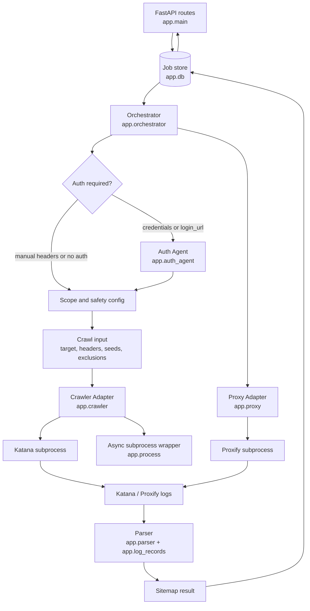

### **Architecture: Tenzai AI-Driven, Async Web Crawler**

Tenzai Crawler is an **Async-Native Web Crawler** designed to solve two critical failures in existing tools:

1. **Authentication:** Uses an AI Agent (LLM \+ Playwright) to handle complex logins, not humans.
2. **Safety ("Do No Harm"):** Enforces strict scoping rules and regex-based exclusions to prevent destructive actions during crawling.

The system is designed as a **single-user, standalone tool** that is deployable on Kubernetes. It prioritizes stability and data persistence using a **StatefulSet** architecture while keeping the stack simple (SQLite, Proxify, Python Asyncio).

### **System Architecture**

**Deployment Model:** Kubernetes StatefulSet (Replicas: 1\) **Storage:** Persistent Volume Claim (PVC) mounted at `/data`.

**Database:** `/data/jobs.db` (SQLite)

**Artifacts:** `/data/traffic_{job_id}.jsonl` (Proxify logs), `/data/screenshots/`

### **Data Flow**

#### **Phase 1: Submission & Initialization**

1. User Request: User POSTs a job to `/jobs`.
   * Payload includes `target_url`, `scope_config`, and `auth_config`.
   * Security: Passwords are provided as *Environment Variable References* (e.g., `{{env:SITE_PASSWORD}}`), never plaintext.
2. Job Creation: Orchestrator inserts a record into `jobs.db` with status `pending`.
3. Proxy Start: Orchestrator spawns `proxify`, directing output to `/data/logs/{job_id}.jsonl`.

   #### **Phase 2: AI-Driven Authentication**

1. Secret Resolution: Orchestrator resolves `{{env:SITE_PASSWORD}}` to the actual value using `os.getenv`.
2. Browser Launch: Playwright launches, configured to tunnel traffic through `localhost:8888` (Proxify).
3. LLM Loop:
   * Agent observes page → Sends to LLM → LLM decides action → Agent acts.
   * Repeats until "LoggedIn" state is detected or `max_steps` is reached.
4. Session Extraction: Orchestrator extracts `cookies` and `Authorization` headers from the browser context.

   #### **Phase 3: Crawling**

1. Crawler Launch: Orchestrator spawns `katana`.
   * Flags: `-proxy http://127.0.0.1:8888` (to log traffic).
   * Auth: Headers/Cookies injected via CLI flags.
2. Safety Enforcement:
   * Scope: `-field-scope` restricts crawling to the target FQDN.
   * Exclusions: `-crawl-out-scope` applies Regex patterns (e.g., `logout|delete|remove`) to prevent destructive clicks.
3. Monitoring: Orchestrator watches the process. If `katana` stalls (no output for 60s) or exceeds memory limits, it is terminated.

   #### **Phase 4: Artifact Generation**

1. Cleanup: `proxify` and `katana` processes are cleanly terminated (SIGTERM).
2. Processing: Orchestrator reads `/data/logs/{job_id}.jsonl`.
3. Result: A normalized `sitemap.json` is generated and the job status is updated to `completed`.

### **Component Descriptions**

**Orchestrator (FastAPI):**

* Entry point for Job creation.
* Manages the SQLite state (`jobs.db`).
* **Startup Routine:** On boot, checks DB for jobs marked `running` or `crawling`. Automatically transitions them to `failed_interrupted` to handle pod restart scenarios.

**Auth Agent (Playwright \+ LLM):**

* **Role:** Initial Navigation.
* **Logic:** Launches a browser context to handle login. It captures the DOM, sends simplified text representations to an LLM, and executes the LLM's suggested actions (click, type, wait).
* **MFA Handling:** Equipped with specific tools to retrieve TOTP codes or parse email verification links.

**The Proxy (Proxify):**

* **Role:** Passive traffic capture.
* **Implementation:** Runs as a background subprocess listening on `127.0.0.1:8888`.
* **Output:** Streams HTTP/S traffic to a JSONL file on the PVC. This file becomes the "Source of Truth" for the site map.

**The Crawler (Katana):**

* **Role:** Fast, "dumb" crawling.
* **Implementation:** ProjectDiscovery's `katana` binary running as a subprocess.
* **Configuration:** Consumes the authenticated session (cookies/headers) from the Auth Agent to crawl behind login screens.
*

### **Design**

It is a stateful, async-native service.

* **API Server:**
  * The API's role: validate input, interact with the state manager (SQLite), and spawn a background task.
* **Orchestrator:**
  * When a job is created, the API spawns an async background task (e.g., asyncio.create\_task(run\_job, job\_id)).
  * This run\_job function is a single, long-running function that contains the workflow (launch browser, auth, launch katana, monitor, cleanup).
* **State Management (SQLite):**
  * A single SQLite database file (e.g., jobs.db) will store the state.
  * The schema will be simple: (job\_id, status, target\_url, auth\_config, focus\_guide, created\_at, finished\_at).

### **Implementation & Development Strategy**

#### **Phase 1: Foundation & State Management (The "Skeleton")**

**Goal:** Get a stable API running on Kubernetes that persists data and handles crashes gracefully.

* **1.1 Kubernetes Manifests:**
  * Write `statefulset.yaml` with `replicas: 1` and a `volumeClaimTemplate` for `/data`.
  * Write `service.yaml` to expose the API.
  * Write `Dockerfile` (Python 3.11 \+ Playwright \+ Katana binary \+ Proxify binary).
* **1.2 Database & API Scaffold:**
  * Initialize `FastAPI` project with `aiosqlite`.
  * Create `jobs` table schema in `jobs.db`.
  * Implement `POST /jobs` (create job) and `GET /jobs/{id}` (check status).
* **1.3 The "Zombie Killer" Logic:**
  * Implement the FastAPI `lifespan` handler.
  * **Logic:** On startup, run `UPDATE jobs SET status='failed_interrupted' WHERE status IN ('running', 'crawling', 'authenticating')`.
  * *Deliverable:* A deployed pod that retains data after a `kubectl delete pod` command.

#### **Phase 2: The Proxy & Process Layer (The "Eyes")**

**Goal:** specific logging of HTTP traffic to a file using Proxify.

* **2.1 Async Process Wrapper:**
  * Create the `run_safe_subprocess` utility in Python.
  * Ensure it handles `SIGTERM` correctly (killing child processes if the parent dies).
* **2.2 Proxify Integration:**
  * Implement the logic to spawn `proxify` on `localhost:8888` for a specific job.
  * Verify it writes to `/data/traffic_{job_id}.jsonl`.
* **2.3 Artifact Parsing:**
  * Write a utility function to parse the `.jsonl` file and convert it into a simple JSON sitemap for the API response.
  * *Deliverable:* You can submit a URL, the system "crawls" it (even if just with `curl` for now), and you see the traffic logs in the PVC.

#### **Phase 3: The Crawler (The "Legs")**

**Goal:** Integrate Katana for bulk crawling with strict safety rules.

* **3.1 Katana Integration:**
  * Hook up `katana` to run through the `localhost:8888` proxy.
  * Pass the target URL and configuration via CLI flags.
* **3.2 Scoping Logic:**
  * Implement the Regex builder for `-crawl-out-scope` (e.g., `logout|delete`).
  * Implement the FQDN extraction for `-field-scope`.
* **3.3 Job Lifecycle:**
  * Connect the dots: Start Proxy \-\> Start Katana \-\> Wait \-\> Stop Proxy \-\> Parse Logs \-\> Update DB.
  * *Deliverable:* A fully functional "dumb" crawler that respects scope and logs traffic.

#### **Phase 4:  Authentication (The "Brain")**

**Goal:** Add the "Smart" layer to handle logins before Katana starts.

* **4.1 Playwright Setup:**
  * Configure Playwright to use the local proxy (`localhost:8888`).
  * Implement the "Context Saver" (exporting `cookies.json` and `storage_state.json`).
* **4.2 LLM Agent Loop:**
  * Build the loop: `Get Page State` \-\> `Send to LLM` \-\> `Execute Action`.
  * Implement the `{{env:VAR}}` secret resolution logic.
* **4.3 Handoff:**
  * Pass the `cookies.json` from Playwright into Katana's `-H "Cookie: ..."` flag.
  * *Deliverable:* The system can login to a test site (like DVWA) and then crawl the authenticated pages safely.

### **Testing Strategy**

* **Test Target Sites:**
  * A suite of self-hosted test applications (e.g., simple Flask/Node apps) is required to validate all phases.
  * **Site A (Static):** A simple 3-5 page static HTML site.
  * **Site B (Simple Login):** A page with a standard /login form.
  * **Site C (Registration):** A page with a /register form.
  * **Site D (Complex Auth):** A page with multiple buttons ("Sign In," "Register," "Sign in with Google").
  * **Site E (Crawl Trap):** A page with a "calendar" that generates infinite links.
  * **Site F (Simple SPA):** A small React/Vue blog.
